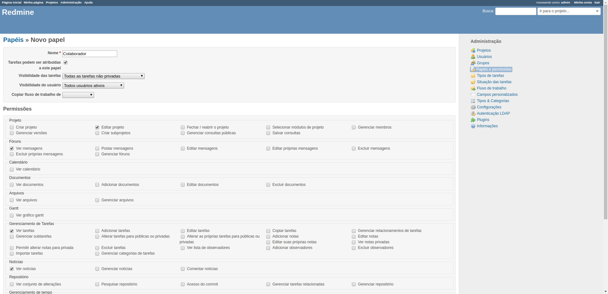
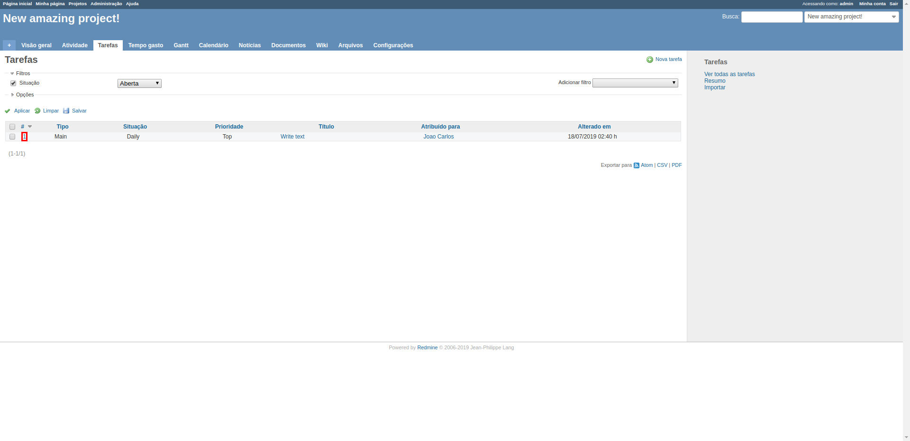

# Welcome to Redmine. Look at the main page!


```python
from guide_automator_function import *

get('localhost:84/')
takeScreenshot()


```


# Click on login!


```python
highlight('.login')
takeScreenshot()
click('.login')
```


# Now, insert the default Admin credentials


```python
clearInput('#username')
fillIn('#username', 'admin')
clearInput('#password')
fillIn('#password', 'admin')
takeScreenshot()
```


# Click on 'Entrar'!


```python
highlight('input[type=submit]')
takeScreenshot()
click('input[type=submit]')
```


# Fill in the new password and click on submit!


```python
fillIn('#password', 'admin')
fillIn('#new_password', '12345678')
fillIn('#new_password_confirmation', '12345678')
highlight('input[name="commit"]')
takeScreenshot()
click('input[name="commit"]')
```


# Now, lets see our projects, clicking on 'Projetos'


```python
highlight('.projects')
takeScreenshot()
click('.projects')
```


# You don't have projects! Lets create one, clicking on 'Novo projeto'


```python
highlight('a.icon-add')
takeScreenshot()
click('a.icon-add')

```


# Now, insert informations about your project!


```python
fillIn('#project_name', 'New amazing project!')
fillIn('#project_description', 'I will change my life!')
takeScreenshot()
```


# Now, click on 'Criar'!


```python
highlight('input[name="commit"]')
takeScreenshot()
click('input[name="commit"]')

```


# Now, lets create a new user! Click on 'Administração'


```python
highlight('.administration')
takeScreenshot()
click('.administration')
```


# Click on 'Usuários'


```python
highlight('.users')
takeScreenshot()
click('.users')
```


# Click on 'Novo usuário'


```python
highlight('a.icon-add')
takeScreenshot()
click('a.icon-add')
```


# Now, insert the informations about the new user and click on 'Criar'


```python

```


```python
fillIn('#user_login', 'Joao_carlos')
fillIn('#user_firstname', 'Joao')
fillIn('#user_lastname', 'Carlos')
fillIn('#user_mail', 'joaocarlos@gmail.com')
fillIn('#user_password', 'abcdefg10')
fillIn('#user_password_confirmation', 'abcdefg10')
selectItemOnDropdownByVisibleText('#user_language', 'Portuguese (Português)')
highlight('input[name="commit"]')
takeScreenshot()
click('input[name="commit"]')
```


# Now, click on 'Administração'


```python
highlight('.administration')
takeScreenshot()
click('.administration')
```


# Click on 'Papéis e permissões'


```python
highlight('.roles')
takeScreenshot()
click('.roles')
```


# Now, to create a new role, click on 'Novo papel'


```python
highlight('.icon-add')
takeScreenshot()
click('.icon-add')
```


# Fill in the fields and click on 'Criar'


```python
fillIn('#role_name', 'Colaborador')
click('input[value="edit_project"]')
highlight('input[name="commit"]')
takeScreenshot()
click('input[name="commit"]')
```





# Now, return to your project!


```python
highlight('.projects')
takeScreenshot()
click('.projects')
```


# Select your project!


```python
highlight('#projects-index a')
takeScreenshot()
click('#projects-index a')
```


# Go to 'Configurações'


```python
highlight('.settings')
takeScreenshot()
click('.settings')
```


# Click on 'Membros'


```python
highlight('#tab-members')
takeScreenshot()
click('#tab-members')
```


# Click on 'Novo membro'


```python
highlight('#tab-content-members a')
takeScreenshot()
click('#tab-content-members a')
sleep(2)

```


# Select the user, the role, and click on 'Adicionar'


```python
click('#principals > label:nth-child(1) > input[type=checkbox]')
click('input[name="membership[role_ids][]"]')
highlight('#member-add-submit')
takeScreenshot()
click('#member-add-submit')
```


# Now, go to 'Administracao'!


```python
highlight('.administration')
takeScreenshot()
click('.administration')
```


# Click on "Situação das tarefas"


```python
highlight('.issue-statuses')
takeScreenshot()
click('.issue-statuses')
```


# To create a new situation, click on 'Nova situação'


```python
highlight('.icon-add')
takeScreenshot()
click('.icon-add')
```


# Fill the name and click on 'Criar'


```python
fillIn('#issue_status_name', 'Daily')
highlight('input[name="commit"]')
takeScreenshot()
click('input[name="commit"]')

```


# Return to 'Administracao'


```python
highlight('.administration')
takeScreenshot()
click('.administration')
```


# Click on 'Tipos de tarefas'


```python
highlight('.trackers')
takeScreenshot()
click('.trackers')
```


# To create a new issue type, click on 'Novo tipo'


```python
highlight('.icon-add')
takeScreenshot()
click('.icon-add')
```


# Fill the name, select the situation and create


```python
fillIn('#tracker_name', 'Main')
click('input[name="tracker[project_ids][]"]')
selectItemOnDropdownByVisibleText('#tracker_default_status_id', 'Daily')
highlight('input[name="commit"]')
takeScreenshot()
click('input[name="commit"]')


```


# Return to 'Administração'


```python
highlight('.administration')
takeScreenshot()
click('.administration')
```


# Click on 'Tipos & Categorias'


```python
highlight('.enumerations')
takeScreenshot()
click('.enumerations')
```


# Click on 'Novo' under 'Prioridade das tarefas'


```python
highlight('a[href="/enumerations/new?type=IssuePriority"]')
takeScreenshot()
click('a[href="/enumerations/new?type=IssuePriority"]')
```


# Fill in the name and click on 'Criar'


```python
fillIn('#enumeration_name', 'Top')
highlight('input[name="commit"]')
takeScreenshot()
click('input[name="commit"]')
```


# Return to your project!


```python
highlight('.projects')
takeScreenshot()
click('.projects')
```


# Select your project


```python
highlight('#projects-index a')
takeScreenshot()
click('#projects-index a')
```


# Go to 'Configurações'


```python
highlight('.settings')
takeScreenshot()
click('.settings')
```


# Select 'Categoria das tarefas'


```python
highlight('#tab-categories')
takeScreenshot()
click('#tab-categories')
```


# Select 'Nova categoria'


```python
sleep(1)
highlight('#tab-content-categories .icon-add')
takeScreenshot()
click('#tab-content-categories .icon-add')
```


# Fill the name, select the member and click on 'Criar'


```python
fillIn('#issue_category_name', 'Daily')
selectItemOnDropdownByVisibleText('#issue_category_assigned_to_id', 'Joao Carlos')
highlight('input[name="commit"]')
takeScreenshot()
click('input[name="commit"]')

```


# Go to 'Tarefas' on the tab of configurations


```python
highlight('.issues')
takeScreenshot()
click('.issues')
```


# Go to 'Tarefas'


```python
highlight('.issues')
takeScreenshot()
click('.issues')
```


# To create a new issue, click on 'Nova tarefa'


```python
highlight('.new-issue')
takeScreenshot()
click('.new-issue')
```


# Fill the fields, select the responsible and click on 'Criar'


```python
fillIn('#issue_subject', 'Write text')
selectItemOnDropdownByVisibleText('#issue_assigned_to_id', 'Joao Carlos')
highlight('input[name="commit"]')
takeScreenshot()
click('input[name="commit"]')

```


# Click again on 'Tarefas'


```python
highlight('.issues')
takeScreenshot()
click('.issues')
```


# Click on the issue


```python
highlight('#issue-1 > td.id > a')
takeScreenshot()
click('#issue-1 > td.id > a')
```





# Click on edit to change the name


```python
highlight('.contextual:nth-child(1) .icon.icon-edit')
takeScreenshot()
click('.contextual:nth-child(1) .icon.icon-edit')
```


# Fill the title and click on 'Enviar'


```python
fillIn('#issue_subject', 'New name')
highlight('#issue-form > input[type=submit]:nth-child(7)')
takeScreenshot()
click('#issue-form > input[type=submit]:nth-child(7)')
```


# Back to 'Tarefas'


```python
highlight('.issues')
takeScreenshot()
click('.issues')
```


# Select the issue again


```python

highlight('#issue-1 > td.id > a')
takeScreenshot()
click('#issue-1 > td.id > a')
```


# Click on 'Editar'


```python
highlight('.contextual:nth-child(1) .icon.icon-edit')
takeScreenshot()
click('.contextual:nth-child(1) .icon.icon-edit')
```


# Change the item "Terminado" to '100%' and click on 'Enviar'


```python
selectItemOnDropdownByVisibleText('#issue_done_ratio', '100 %')
highlight('#issue-form > input[type=submit]:nth-child(7)')
takeScreenshot()
click('#issue-form > input[type=submit]:nth-child(7)')
takeScreenshot()
close()


```


```python

```


```python

```


```python

```


```python

```


```python

```


```python

```


```python

```


```python

```
